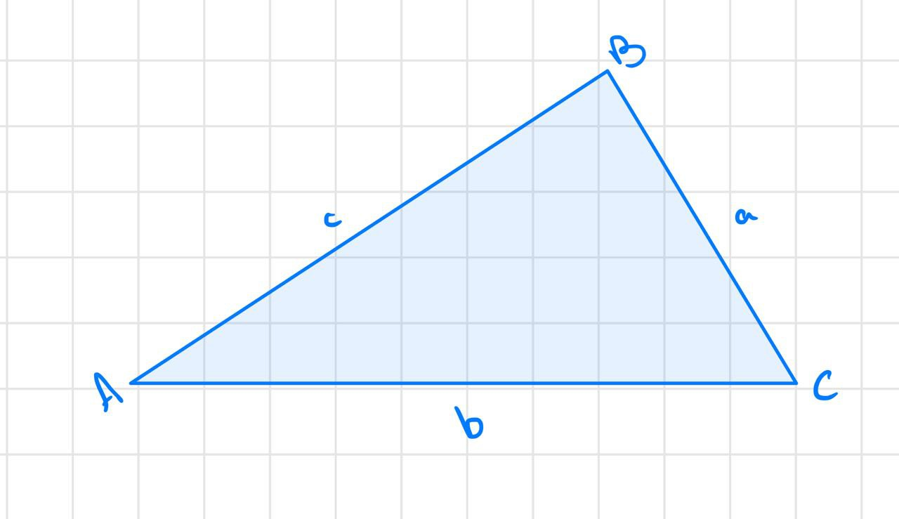
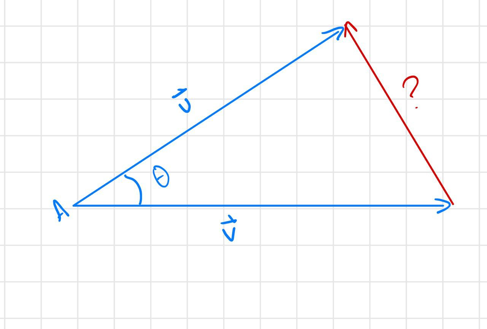

# The Dot Product

### Defninition: The dot product **_adds_** the ***products*** of ***corresponding*** components of two vectors. 

### The result of the dot product gives a ________________________

 What does that mean? Well, let's look at a general example: 

$\mathbf{a} = <a_1, a_2>\\$
$\mathbf{b} = <b_1, b_2>\\$
$c = \mathbf{a}\cdot\mathbf{b}$

 If you had to make an educated guess, what would you say the corresponding componment of $a_1$ is? What about $b_2$?

Right!

So, now, we have to get the **products** of those components:

$c = \mathbf{a}\cdot\mathbf{b} = (a_1)(b_1) + (a_2)(a_2)$

In looking at this equation, do you think you'll get back a vector after computing it? No! We actually get a scalar! (fill in the blank above)

We can actually do a **ton** of things with that scalar. But before we go into that, let's try a more concrete example. I want you to try this problem on your own:

if $\mathbf{u} = 2\mathbf{i}-3\mathbf{j}$, and $\mathbf{v} = -1\mathbf{i}+2\mathbf{j}$, what is $\mathbf{u} \cdot \mathbf{v}$?

$\Rightarrow (2)(-1)+(-3)(2) = -8$

*while they are working out the problem, write out the following identities with the first half:*

Ok, who has the answer? How does everyone feel about this so far? Easy? Hard? Anyone totally confused?

## <ins>Properties: </ins>
1. $\mathbf{u} \cdot \mathbf{v} = \mathbf{v} \cdot \mathbf{u}$ - Commutitive
2. $\mathbf{u} \cdot (\mathbf{v}+\mathbf{w}) = \mathbf{u\cdot}\mathbf{v} + \mathbf{u}\cdot\mathbf{w}$ - Distributive
3. $0\cdot\mathbf{v}=0$
4. $\mathbf{v} \cdot \mathbf{v} = ||\mathbf{v}||^2$
5. $(c\mathbf{u}) \cdot \mathbf{v} = c(\mathbf{v} \cdot \mathbf{u})=\mathbf{u} \cdot (c\mathbf{v})$

* so as you look at the problem we just did, does it matter if we reverse these two numbers and these two numbers? No, it doesn't. So that means the dot product follows the commutative property, which is to say u dot v will have the same result as v dot u
* There are some other ones i'm sure you're familiar with. The dot product is also distributive. If you have a vector multiplying the sum of two vectors, it's also the same as... 
* Here, we introduce the zero vector. Can anyone tell me what the zero vector is? Right, it's a vector that has no magnitude or direction. It still has a value, and it's value is $<0,0>$ and it's just the origin in vector form. So if you take the zero vector times any vector, you're going to get the zero. Question, would you get the zero vector, or just zero? Just zero, because remember, the result of the dot product is always a scalar!
* Now this one is a little more interesting. What do you think happens when you do the dot product of a vector with itself? Well, let's work it out:
We have:
 $\\ \mathbf{v} = <v_1, v_2> \\ \Rightarrow\mathbf{v}\cdot\mathbf{v}$ equals what? What are the corresponding components again?
 $\\ \Rightarrow (v_1)(v_1)+(v_2)(v_2)$ Now instead of just saying v1 times v1, what could you say instead? Could you say... v1 squared plus v2 squared? Absolutely!
 $\\ \Rightarrow v_1^2 + v^2_2$
 So what does this look eerily similar to? Does anyone remember how we get the magnitude of a vector? Tell me how you would get the magnitude of v. You'd put these exact values under the square root 
 $\\$ You would put these exact values under the square root sign, correct? What happens if you take all that, and square it? it cancels out that square root, right? Awesome! So therefore, v dot v is equal to the magnitude squared!. Pretty awesome, right?!  

* Finally, if we are multiplying those vectors by a scalar, there's a couple of different ways you can do it. you can do the dot product of v and u first, and THEN multiply by the scalar, or you could move the scalar to the other vector, and multiply that by u. Basically, wherever you put the scalar, it doesn't really matter and you're going to get the same answer.

So what is the point of all this? Why do we even want to find the dot product?

The dot product is an easy way we can combine two vectors. Also, it tells us something about how much two vectors point in the same direction. We can even use it to find the angle between two vectors. Let's try one more simple example:

if $\mathbf{u} = 3\mathbf{i}+6\mathbf{j}$, and $\mathbf{v} = -4\mathbf{i}+2\mathbf{j}$, what is $\mathbf{u} \cdot \mathbf{v}$?

Raise your hand if you got zero. If you did, awesome! This means that these two vectors are orthogonal. Can anyone tell me what orthogonal means? Excellent

Two *nonzero* vectors are ***orthogonal*** when the angle between the vectors is $90 \degree$

This essentially means the same thing as perpendicular, this is just the what we call it when we are talking about vectors.

So ok, the dot product can help us find orthogonal vectors, but what if it's not orthogonal? Can we just take the scalar and determine the angle between the vectors? Yes, but it takes a bit more calculations. Can anyone tell me from your other lessons what the law of cosines says? 

## <ins>Law of Cosines: </ins>

$a^2 = b^2+c^2-2\cdot bc \cdot \cos(a)$ 

**The purpose of the law of cosines is to relate the angles in a triange to the lengths of the sides.**

What you guys all need to really hone in is that, see how we have all these c's and b's here? This angle A has everything to do with the angle that's between c and be, and across from our result here a squared.

So doesn't a triangle kind of look like 3 vectors put together? Let's see how we can relate this law of cosines to our dot product.

So if we have two vectors that are not parallel, they will eventually cross, correct? If that's true, then there will be an angle between them, and we can find that using our dot product and 

so how do we get the vector that connects $\mathbf{u}$ and $\mathbf{v}?$

well, say this vector is just unknown:

$\mathbf{v} + ? = \mathbf{u}$ so, $? = \mathbf{u} - \mathbf{v}$, right?

**initial to terminal plus initial to terminal equals initial to terminal, remember?**

Now, looking back at the triangle... a b and c are what? Lengths. Are u, v, and w lengths? 

NO they are vectors! 

How do we find the lengths from vectors again? Find the magnitude! Exactly.

