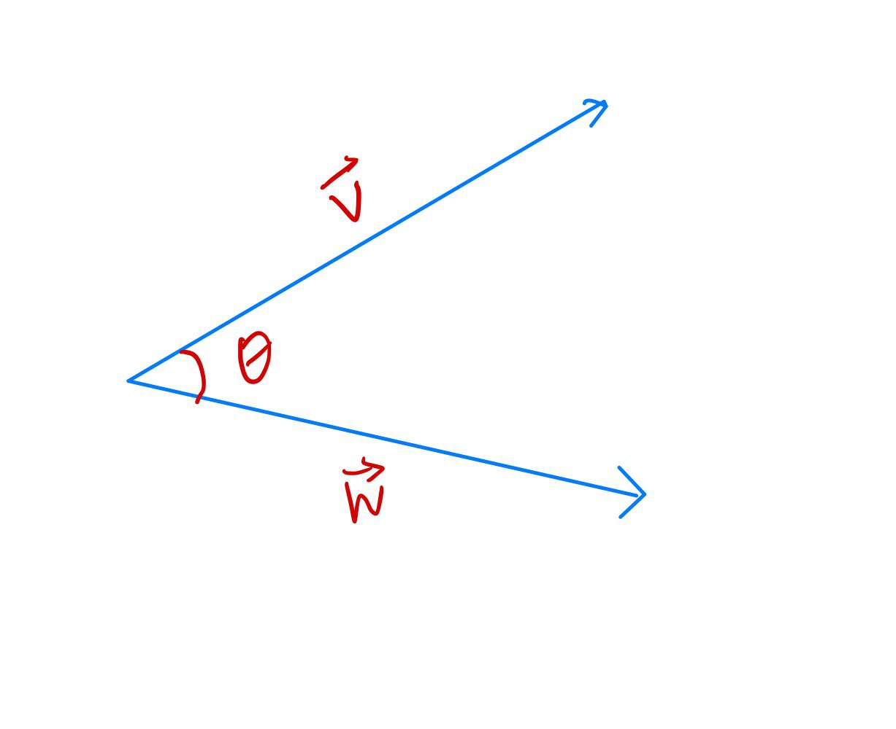
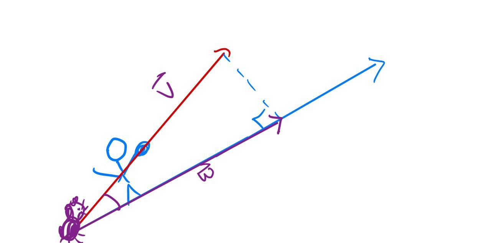
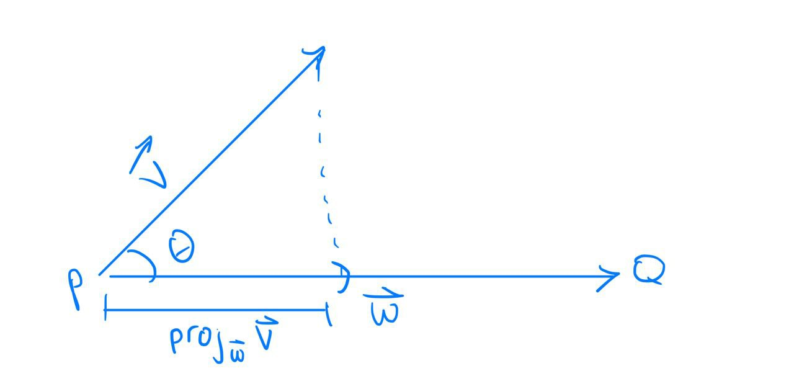
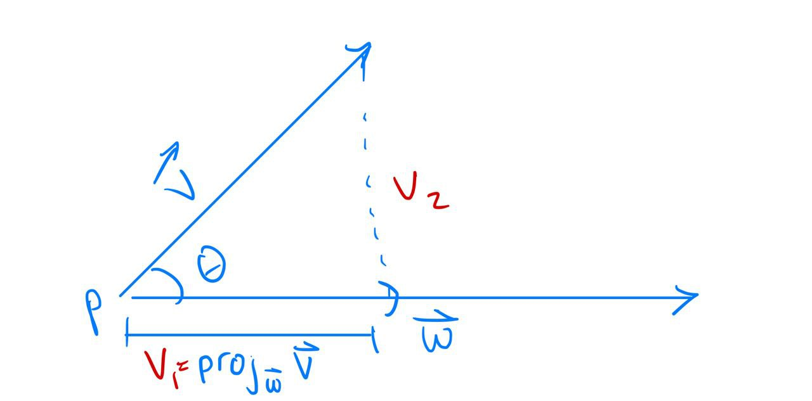
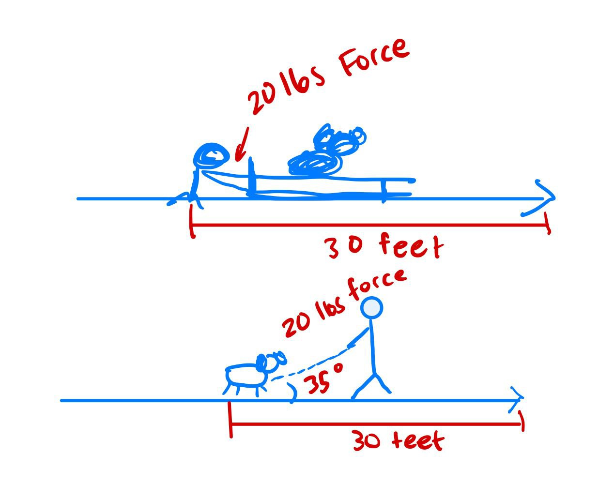

# The Dot Product Part II

Good morning! You guys have already learned about the dot product, but today we're going to talk about how it's actually useful. But first, let's have a little review just to refresh your memory and then do a couple examples: 

### Definition: The dot product _______________ (**_adds/multiplies_**) the ___________________ (***products/sum***) of ***corresponding*** components of two vectors. 

### The result of the dot product gives a ________________________ (***scalar***) What about if you multiply a scalar times a vector, does that give you a scalar too? No, you get a vector!

 Great! Let's do two quick examples: 

## <ins>Example 1</ins>

if $\mathbf{u} = 2\mathbf{i}-3\mathbf{j}$, and $\mathbf{v} = -1\mathbf{i}+2\mathbf{j}$, what is $\mathbf{u} \cdot \mathbf{v}$?

$\Rightarrow (2)(-1)+(-3)(2) = -8$

if $\mathbf{u} = 3\mathbf{i}+6\mathbf{j}$, and $\mathbf{v} = -4\mathbf{i}+2\mathbf{j}$, what is $\mathbf{u} \cdot \mathbf{v}$?

$\Rightarrow (3)(-4)+(6)(2) = 0$

Looking at these two examples, are any of them orthogonal? Yes! The second one. How do you know? *because it equals zero* Great job! What does orthogonal mean? *It means those to vectors have a right angle between them.* Awesome job.

Ok, now, do you all remember how to get the angle even if it's not orthogonal? 

Remember that using the dot product and the law of Cosines is what helps us relate the sides of the triangle to the *angles* of the triangle

DRAW THIS ON THE BOARD

Who can tell me the formula for finding the angle between two vectors v and w?

$\cos\theta =$______________ what?
$\\\cos\theta =\frac{\mathbf{v} \cdot \mathbf{w}}{||\mathbf{v}||\cdot ||\mathbf{w}||}$

But this doesn't give us the angle, right? What do we need to do to get the angle? YES, exactly, get the inverse cosine.

$\\\theta = \cos^{-1}(\frac{\mathbf{v} \cdot \mathbf{w}}{||\mathbf{v}||\cdot ||\mathbf{w}||})$

So let's do another quick example and then we'll teach you the real stuff for today's lesson: 

## <ins>Example 2</ins>
if $\mathbf{v} = 2\mathbf{i}-\mathbf{j}$, and $\mathbf{w} = 3\mathbf{i}+4\mathbf{j}$, what is the angle between $\mathbf{v}$ and $\mathbf{w}$?

$\Rightarrow \mathbf{v}\cdot\mathbf{w}=(2)(3)+(-1)(4) = 2$

Now remember, if the result of this dot product is zero, there's really no reason to continue your calculations because we know if the end result is zero, the angle will be 90$\degree$, right? I recommend always calculating this part first.

$\Rightarrow ||\mathbf{v}|| = \sqrt{2^2 + (-1)^2} =\sqrt{5}\\$
and $||\mathbf{w}|| = \sqrt{3^3 + 4^2} = \sqrt{25} = 5$

$\Rightarrow \theta = \cos^{-1}(\frac{2}{5\sqrt5}) \approx 79.7 \degree$

* Everyone ok with this? Any questions? Ok awesome, now let's move on to some really fun physics-y stuff. Yay!

* Ok raise your hand if you have a dog at home. Raise your hand if you have the easiest dog to walk in the whole world because they stay right next to you and never misbehave and they are perfect angels? Wow, you're lucky!!

* Ok, now how many of you, when you're walking your dog, you're having to drag him along because all they want to do is smell EVERYTHING? My dog does that to me constantly! 

* Well if you're one of those people constantly dragging your dog along, this is for you! So say your dragging him up a hill, is all your energy only going to dragging him up this hill? No, it also takes energy to pull him upwards from the ground because you're taller than your dog. 

* So if we're looking at this angle here, we can figure out how much *force*, or how much *vector* v would creat in the *w* direction.
  
* Def: <ins>Vector projection</ins> - the vector $\mathbf{v}f$ creates in the direction of $\mathbf{w}$

So basically... what is the direction that v makes along w? How much of v is being applied in the *w* direction?

Let's look at the notation for vector projection: 
$\mathbb{proj}_{\mathbf{w}}\mathbf{v}$

The magnitude of $\mathbb{proj}_{\mathbf{w}}\mathbf{v}$ is called scalar or component projection.

 Just so we're clear on the notation, what would this notation mean? 
$\mathbb{proj}_{\mathbf{a}}\mathbf{b}$

The projection of vector.... **a** on to vector.... **b** exactly, great job. Please make sure you understand this, because your teacher might not give you v's and w's on the test! 

Now look a this triangle here, is it clear to you how we would find this length there? We know a lot about right triangles already, right? If you have this hypoteneuse here, and this angle here, couldn't we find this adjacent side here? But remember that in using this, you'll be finding the *magnitude* of the vector w, so our formula would look like this:

$\cos\theta = \frac{||\mathbb{proj}_{\mathbf{w}}\mathbf{v}||}{||\mathbf{v}||}$

but we're looking for the projection's magnitude, right? So how do we find the projection? Right, multiply cosine by the magnitude of vector v

$||\mathbb{proj}_{\mathbf{w}}\mathbf{v}|| = \cos\theta \cdot||\mathbf{v}||$

But, this is all assuming that we have this angle here, theta. But what if we don't. Any ideas? Well, let's go back to that formula we have to find the angle between two vectors:

$\\\cos\theta =\frac{\mathbf{v} \cdot \mathbf{w}}{||\mathbf{v}||\cdot ||\mathbf{w}||}$

If we plug this in for cosine theta here, we then have

$||\mathbb{proj}_{\mathbf{w}}\mathbf{v}|| =\frac{\mathbf{v} \cdot \mathbf{w}}{||\mathbf{v}||\cdot ||\mathbf{w}||}\cdot||\mathbf{v}||$

Do you see anything we can eliminate here? Yes, the magnitude of v. So our final formula becomes: 

$||\mathbb{proj}_{\mathbf{w}}\mathbf{v}|| =\frac{\mathbf{v} \cdot \mathbf{w}}{||\mathbf{w}||}$

* so to help you understand... if we don't know the angle between the vectors, we use this formula. If we do, we use the first formula. Understand? Are there any questions? If I've lost you, please raise your hand!

But here's the thing. This formula only gives a scalar because we were finding the *magnitude* of the projection. But what if we want the actual vector? Well then we need to take this formula and multiply it by the unit vector in the direction of w, right?

So, $\Rightarrow\mathbb{proj}_{\mathbf{w}}\mathbf{v} = \frac{\mathbf{v} \cdot \mathbf{w}}{||\mathbf{w}||}\cdot \frac{\mathbf{w}}{||\mathbf{w}||}$ 

which simplifies to

$\mathbb{proj}_{\mathbf{w}}\mathbf{v} = \frac{\mathbf{v} \cdot \mathbf{w}}{||\mathbf{w}||^2}\cdot \mathbf{w}$

Easy, right? Alright alright enough definitions and formulas, let's try an example: 

## <ins>Example 3</ins>
if $\mathbf{v}= 2\mathbf{i}+4\mathbf{j}$, and $\mathbf{w} = -2\mathbf{i}+6\mathbf{j}$, what is $\mathbb{proj}_{\mathbf{w}}\mathbf{v}$?

$\mathbb{proj}_{\mathbf{w}}\mathbf{v} = \frac{\mathbf{v} \cdot \mathbf{w}}{||\mathbf{w}||^2}\cdot \mathbf{w} = \frac{(2\mathbf{i}+4\mathbf{j})\cdot(-2\mathbf{i}+6\mathbf{j})}{\sqrt{(-2)^2+6^2}^2}\cdot(-2\mathbf{i}+6\mathbf{j})$

ok first let's get the dot product to make sure it's not zero, right?

$v\cdot w = (2)(-2)+(4)(6)\\ \Rightarrow -4+24 = 20$

Then the magnitude of w is: 

$||\mathbf{w}|| = \sqrt{(-2)^2+6^2}\\ \Rightarrow \sqrt{40}$

but because we're squaring a square root, that just cancels out, so we can leave it as 40. So now, we have

$\frac{20}{40}\cdot(-2\mathbf{i}+6\mathbf{j}) \\ \Rightarrow \frac{1}{2}(-2\mathbf{i}+6\mathbf{j})\\ \Rightarrow -\mathbf{i}+ 3\mathbf{j}$

Now let's look back at our vectors v and w. What if we wanted to project w onto v? This would just mean that we would extend the v vector, and it would look more like this: 

Now, is it true that if you have a vector, you can always break it up into it's two orthogonal components? YES it is. You can have the projection component, or $v_1$, and  you also have the orthogonal component $v_2$ here. We know that if we add these two together, it will give us our original vector.

any idea how we would calculate $v_2$ from v and it's projection? Yep!

$v_2 = v - v_1$, where $v_1 = \mathbb{proj}_{\mathbf{w}}\mathbf{v}$ easy!

So, let's try an example with our previous vecctors : 

## <ins>Example 3.2</ins>
$\mathbf{v}= 2\mathbf{i}+4\mathbf{j}$, and $\mathbf{w} = -2\mathbf{i}+6\mathbf{j}$ find $\mathbf{v_1}$ and $\mathbf{v_2}$ where v2 is the vector orthogonal to v's projection.

Well, we already calculated $v_1$ before, right? Anyone remember? Right, it was $\\ \Rightarrow -\mathbf{i}+ 3\mathbf{j}$

So then $\\\mathbf{v_2} = (2\mathbf{i}+4\mathbf{j})-(-\mathbf{i}+ 3\mathbf{j}) \\ \Rightarrow 3\mathbf{i}+\mathbf{j}$

Alright you guys, now it's time for real physics stuff. Aren't you excited!? A little?

Remember our dog example before? Your dragging along your dog up a hill. Well how much WORK does it take to drag him up that hill? What is work? 
### <ins>**Definition**</ins>
<ins>Work</ins> - Work is the <ins>component</ins> of a <ins>force</ins> (vector) along a directed path (vector). Therefore,

w = (magnitude of force)x(Distance) (or how much you actually moved it) = $\mathbf{F}\cdot\mathbb{d} = ||\mathbf{F}||\cdot||\mathbf{d}||\cdot\cos\theta$

Is work a vector or a scalar? Raise your hand if you think it's a scalar. Awesome job, that's correct!

## <ins>Example 4</ins>
So if we go back to our dog problem... if you're pushing your dog along on a sled, and it takes 20 pounds of force to push him down a 30 foot path, how much work does that take?

$(20)(30) = 600  foot\cdot pounds$

## <ins>Example 4.2</ins>
Ok ok that was way too easy I know you can do a problem more difficult than that. What if you were going dragging him from his leash at a 35$\degree$ angle? Then how would you calculate it?

easy, you would just multiply that same value by the cos of 35$\degree$
$600\cdot\cos35\degree\approx 491.5 ft\cdot pounds$

That's all I have for you guys today, thank you guys for letting me come in and teach you. I'm really impressed you all are a really smart group! I hope you all liked the lesson today!